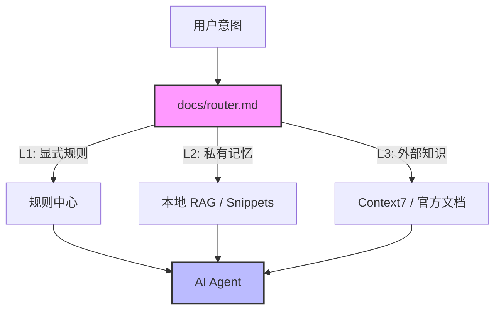

<div align="center">
  
  <h1>AI Common</h1>
  <p><strong>Your Exocortex for AI Collaboration</strong></p>
  <p>你的外部大脑 · 统一上下文协议 · 混合 RAG 架构</p>

  [](https://github.com/webkubor/AI_Common/actions/workflows/deploy.yml)
  [](https://opensource.org/licenses/MIT)
  [](https://vitepress.dev/)
  [](http://makeapullrequest.com)

  <p>
    <a href="https://webkubor.github.io/AI_Common/">📚 在线文档</a> •
    <a href="#-快速开始">🚀 快速开始</a> •
    <a href="#-核心架构">🏗 核心架构</a>
  </p>
</div>

---

## 📖 简介 (Introduction)

**AI Common** 是一个标准化的 **AI 上下文工程 (Context Engineering)** 基建仓库。它不仅仅是一个文档站点，更是连接人类意图与 AI 能力的桥梁。

通过定义一套统一的、分层的、隐私安全的**长期记忆协议**，它让 Gemini, Codex, Cursor, Claude 等不同 AI Agent 能够共享同一个"大脑"，实现跨平台、跨模型的知识复用与持续进化。

> **"One Context to Rule Them All"**

---

## 🏗 核心架构 (The Hybrid RAG)

本仓库采用 **L1-L3 三层分发体系**，在 Token 效率与隐私安全之间取得完美平衡：



| 层级 | 名称 | 载体 | 核心使命 | 典型内容 |
| :--- | :--- | :--- | :--- | :--- |
| **L1** | **显式规则** (Explicit) | `docs/router.md` / `docs/rules/` | **基准 (Baseline)** | 路由地图、代码规范、Git 协议 |
| **L2** | **私有内脑** (Local RAG) | Milvus / `snippets/` | **经验 (Experience)** | 历史 Bug 复盘、私有 Token、业务代码 |
| **L3** | **官方外脑** (Official RAG) | Context7 | **知识 (Knowledge)** | 腾讯云 API 文档、框架手册 |

### 🔒 隐私设计

*   **Git 追踪**：仅包含通用的 L1 规则与方法论文档。
*   **本地留存**：L2 私有数据（`retrospective.md`, `snippets/`, `env_profile.md`）通过 `.gitignore` 严格屏蔽，物理隔离在本地机器。

---

## ✨ 核心特性 (Features)

- 🧠 **统一路由 (Unified Router)**: AI 自动识别意图，按需加载最相关的规则和技能。
- 📚 **规则中心 (Rule Center)**: 编码规范、Git 提交、工作流程等规则集中管理。
- 🛠️ **插件化扩展 (Extensions)**: 写作、设计、RAG、自动化等能力即插即用。
- 📝 **自动复盘 (Auto Retro)**: 架构、构建、前端、运维等经验持续积累，自动 GC。
- 🎨 **设计系统 (Design System)**: 莫兰迪色系、极简几何风格、双模态设计。

---

## 🚀 快速开始 (Quick Start)

### 1. 接入编辑器
- **Zed**: 项目已内置 `.zedrules`，打开即可自动加载 AI 规则。
- **Cursor/VSCode**: 将 `docs/router.md` 添加到项目的 Rules 或 Context 中。

### 2. 命令行 AI 接入
在 CLI 中输入 `/start` 或直接提问，AI 将自动读取本仓库的 `docs/router.md` 并加载路由。

### 3. 碎片知识记录
- **存**: "记一下 GitHub Token" -> 存入 `docs/snippets/github_token.md` (私有)。
- **查**: "我的 Token 是多少？" -> AI 检索私有库并回答。

---

## 📂 目录结构

```text
AI_Common/
├── docs/                   # 📚 VitePress 文档根目录
│   ├── .vitepress/         # ⚙️ 站点配置
│   ├── extensions/         # 🧩 扩展能力 (Skills)
│   ├── rules/              # 📝 规则中心 (Rules)
│   ├── retrospectives/     # 🧠 复盘经验 (Memory)
│   ├── snippets/           # 💡 代码片段 (Fragments)
│   ├── public/             # 🖼 静态资源
│   ├── index.md            # 🏠 站点首页
│   └── router.md           # 🤖 路由入口 (单一真理来源)
├── scripts/                # 🧰 工具脚本
└── .zedrules               # 📝 Zed 编辑器规则
```

---

## 🤝 贡献 (Contributing)

欢迎提交 Pull Request 来丰富这个通用大脑！无论是新的规则、更好的技能插件，还是架构上的改进，都非常欢迎。

---

<div align="center">
  <p>Maintained by <a href="https://github.com/webkubor">@webkubor</a></p>
  <p>Made with ❤️ and AI</p>
</div>