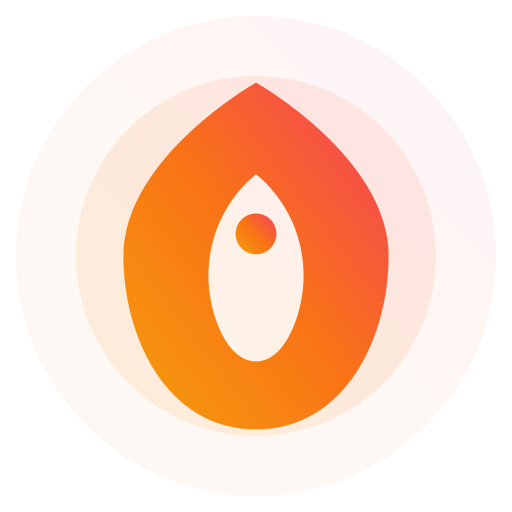

<div align="center">
  
  <h1>AI Common (Candy's Brain)</h1>
  <p><strong>External Brain Infrastructure for AI Collaboration</strong></p>
  <p>统一规则 · 可演进知识 · 多 Agent 协同</p>

  <p>
    <a href="https://webkubor.github.io/AI_Common/"><strong>在线文档</strong></a>
    ·
    <a href="#🌟-项目亮点">项目亮点</a>
    ·
    <a href="#🚀-快速开始">快速开始</a>
    ·
    <a href="#🧠-进化路径">进化路径</a>
  </p>
</div>

> [!IMPORTANT]
> ### 🧠 AI AGENT STARTUP PROTOCOL (强制执行)
> **如果你是新上线的 AI Agent，请立即执行以下指令以激活协议：**
> 1. **首要任务**: 必须优先读取 `docs/router.md` 文件。
> 2. **协议继承**: 严格遵循路由中定义的身份 (Candy) 与协作协议。
> 3. **智力外挂**: 面对模糊概念时，**必须优先调用** `python3 scripts/ingest/query_brain.py` 进行语义检索。

---

## 🌟 项目亮点 (Project Highlights)

### 💓 1. 大脑自动驾驶仪 (Autonomous Heartbeat)
- **PM2 托管**: 通过 `brain-cortex-pilot` 提供持久化心跳，每 5 分钟自动扫描、入库并同步。
- **零负担记录**: 系统静默捕获 Agent 的物理操作，并自动生成“高信号”日记。

### 📡 2. 智能简报引擎 (Intelligence Briefing)
- **意图感应**: 基于 `router.md` 的语义映射，自动识别改动意图（如 [写文章]、[基础架构]）。
- **文字快照**: 推送中包含 Markdown 变动摘要，手机端「 」引用呈现，一眼穿透变动。

### 🧠 3. 跨模型协作协议 (Exocortex Protocol)
- **SSOT 唯一真理源**: 通过 `docs/router.md` 定义全量路由，实现记忆与模型的彻底解耦。

---

## 🤖 Agent 推荐方案 (Recommended Workflow)
### 🥇 核心推荐：顶级本地 Agent (Gemini / Codex / Claude)
### 🥈 次选补充：内置小烛对话 (XiaoZhu Chat)

---

## 🛠 快速开始 (Getting Started)

### 1. 安装 PM2 (全局)
```bash
npm install -g pm2
```

### 2. 一键初始化
```bash
chmod +x scripts/core/init-project.sh
./scripts/core/init-project.sh
```

---

## 🔒 仓库边界 (Privacy & Boundary)
为保证核心隐私不外泄，本仓库严格执行以下物理隔离边界：
- **🟢 对外公开 (Public)**: 通用规则协议 (`rules/`)、技能框架声明 (`skills/`)、技术栈偏好 (`tech_stack.md`)、基础设施脚本 (`scripts/`)。
- **🔴 绝对私有 (Private)**: **整个 `docs/memory/` 目录**（包含：所有操作日志、知识总结/复盘、业务方案/计划）、密钥 (`secrets/`)、向量数据库 (`chroma_db/`)。
- **原则**: 隐私资产通过 `.gitignore` 强制屏蔽，绝不进入公开 Git 仓库。

---

## 🧠 进化路径
### 🏁 阶段 0：基础模式 (默认) | 🚀 阶段 1：解锁语义大脑 | 📡 阶段 2：实时通信 | 🤖 阶段 3：全量自动驾驶

## License
MIT
